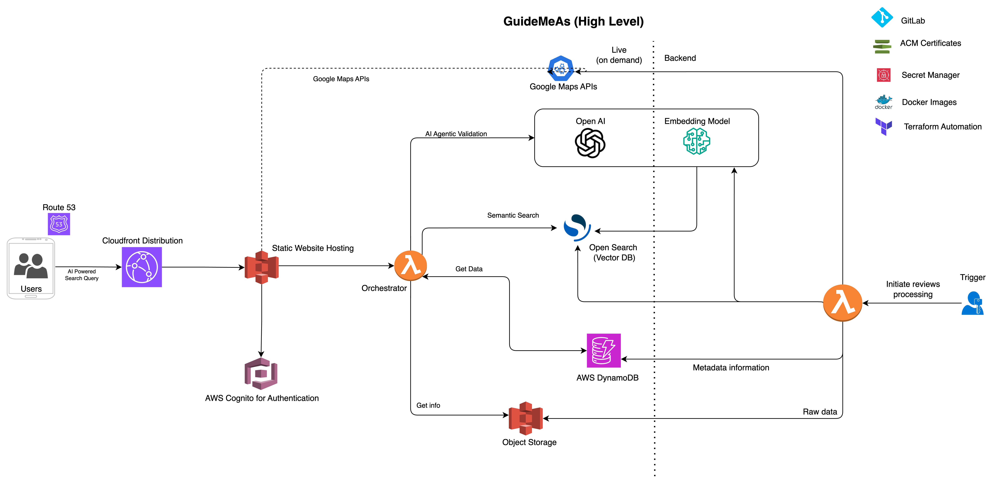
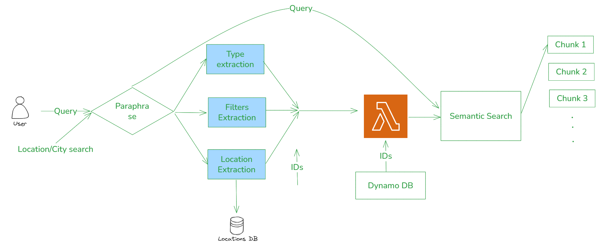

# Semantic Search Flow - Hackathon

This document describes the flow of how a user query is processed, filtered, and searched across our system using semantic search and fine-tuned models.  This feature has been processed for the soonami hackathon, all the features described here and been incorporated during this time.

# High Level Design

# User Query Flow Design (AI for Hackathon)

---

## 🔄 End-to-End Flow

### 1. User Query
The system receives:
- A **query** (e.g., “find the best Italian restaurants in Valencia, open now”)  
- Original **filters** (optional, such as location, price range, etc.)  

---

### 2. Query Processing (Parallel Agents)
The query is paraphrased and analyzed by three parallel extraction modules:

- **Type Extraction** → Identifies cuisine or business type (e.g., "Italian", "restaurant").  
- **Location Extraction** → Extracts city or neighborhood, checked against the **Locations DB**.  
- **Filters Extraction** → Extracts additional constraints (e.g., "open now", "cheap", "family friendly").  

---

### 3. Filters Update
The extracted type, location, and filters are merged to form a structured query representation.  

---

### 4. Initial Record Retrieval
A **Lambda service** retrieves an initial set of candidate record IDs from **DynamoDB**.  

---

### 5. Semantic Search
The retrieved IDs are matched **semantically** using **Pinecone** (via another Lambda service).  
- This step uses a **fine-tuned embedding model**, trained on our in-house dataset, to compute similarity.  

---

### 6. Reranking & Explanation
The candidate results are:  
1. **Reranked** based on semantic relevance.  
2. Enriched with a **reason for the match**, generated by an **LLM**.  

---

### 7. Final Results
The system returns the final ranked list of results (chunks) to the user.  

---

## 📌 Components Overview
- **Locations DB** → Stores cities, regions, and location references.  
- **DynamoDB** → Stores record metadata and IDs.  
- **Lambda Services** → Orchestrate DynamoDB retrieval and Pinecone search.  
- **Pinecone** → Vector database for semantic similarity search.  
- **Fine-tuned Model** → Embedding model trained on our dataset for domain-specific semantic matching.  
- **LLM** → Provides final reranking and reasoning for transparency.  
